# Asesori App

ASESORI is a web platform within the FINTECH scope, which allows people to make a comparison of the different services and products offered by the financial institutions of Ecuador, presents the financial options according to the policies of the Banks or Cooperatives compared to the conditions and needs of their potential customers.

## Installation

This project was generated with [Angular CLI](https://github.com/angular/angular-cli) version 15.0.2.

Clone this repository

```bash
git clone https://github.com/baguilar6174/asesori-web-page.git
```

Install dependencies

```bash
npm i
```

## Running the app

Run `ng serve` for a dev server. Navigate to `http://localhost:4200/`.

## My process

### Built with

- Angular 15
- Typescript
- Bootstrap 5
- SCSS

## Development Features

- Atomic design
- Eslint and Prettier
- Good folder structure
- Husky (Pre commit)

## TODO:

- Custom input
- Create carrusel
- Http request
- Interceptors
- Unit test
  - Coverage report
- Update README
- Documentation
- Internationalization
- Auth (login)

## Asesori App

<table>
  <thead>
    <tr>
      <th colspan="2" style="text-align:center">Desktop content</th>
    </tr>
  </thead>
  <tr>
    <td align="center" valign="center">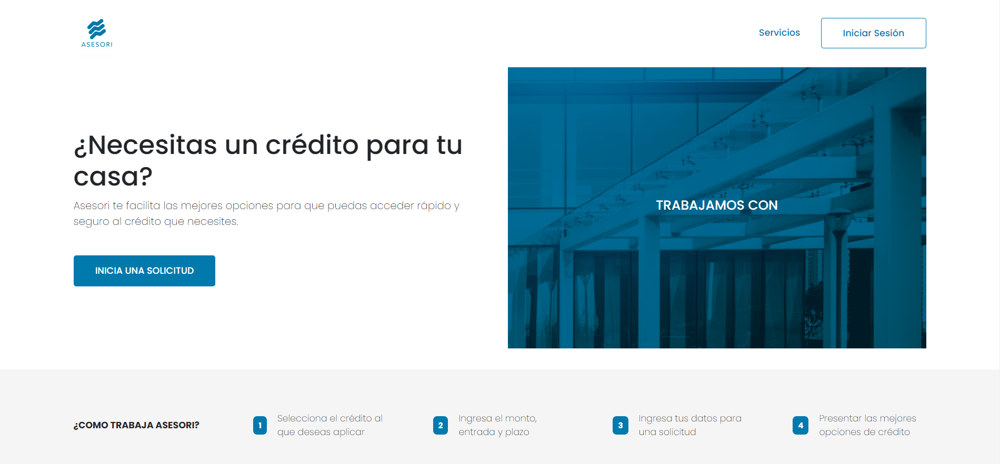</td>
    <td align="center" valign="center">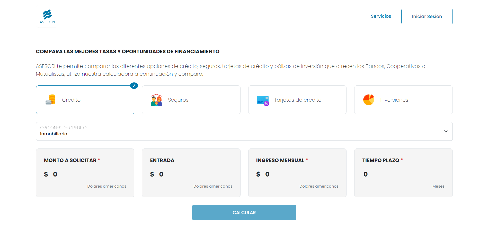</td>
  </tr>
  <tr>
    <td align="center" valign="center">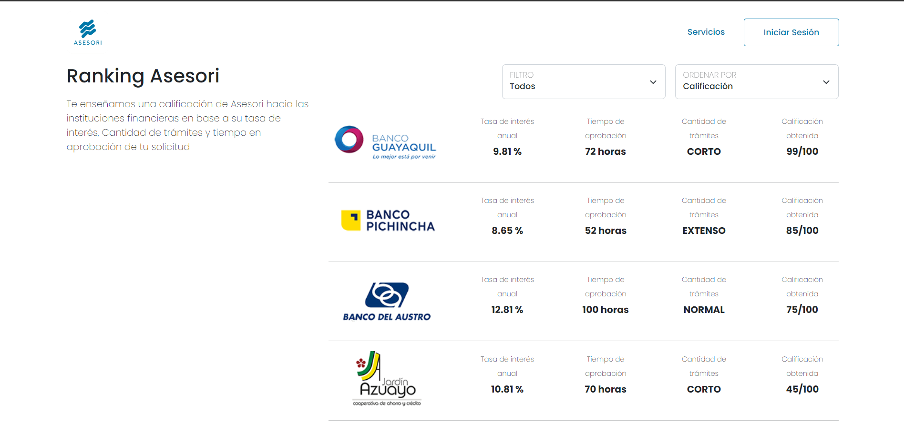</td>
    <td align="center" valign="center">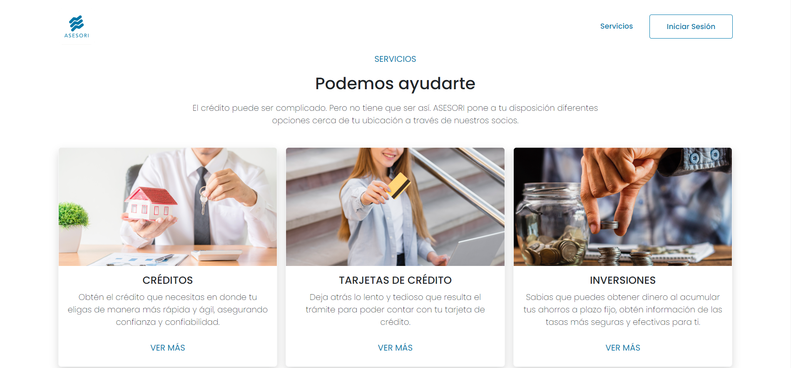</td>
  </tr>
  <tr>
    <td align="center" valign="center">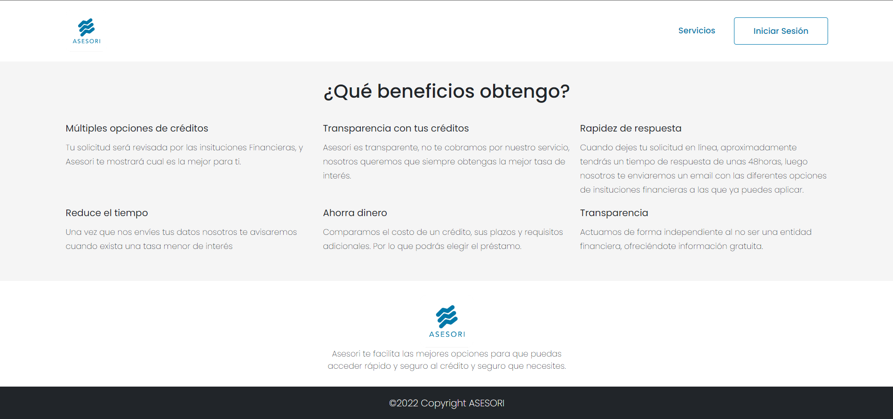</td>
    <td align="center" valign="center">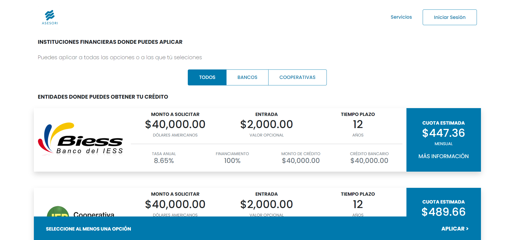</td>
  </tr>
</table>

<table>
  <thead>
    <tr>
      <th colspan="2" style="text-align:center">Mobile content</th>
    </tr>
  </thead>
  <tr>
    <td align="center" valign="center">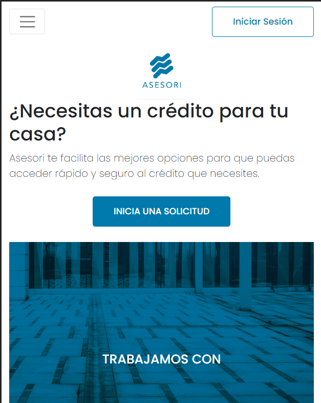</td>
    <td align="center" valign="center">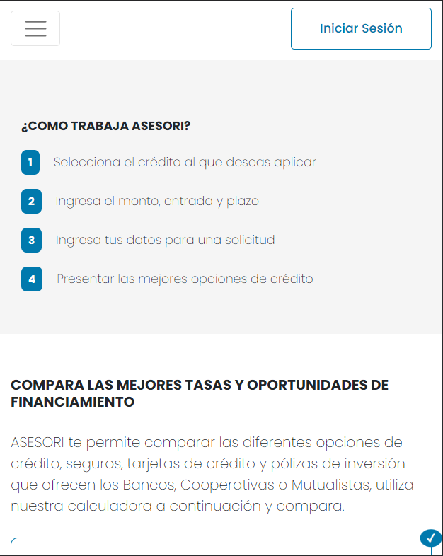</td>
  </tr>
  <tr>
    <td align="center" valign="center">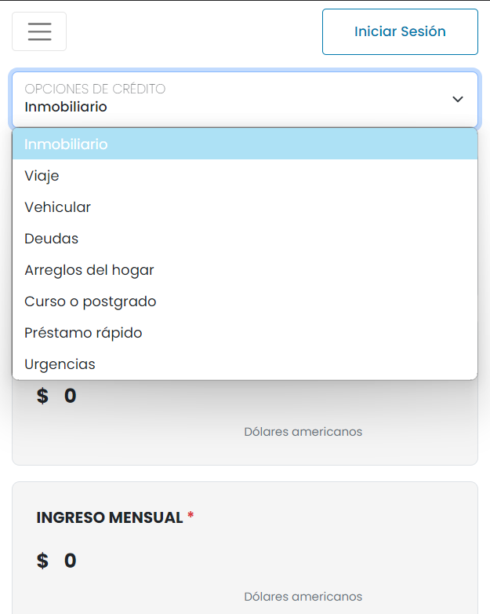</td>
    <td align="center" valign="center">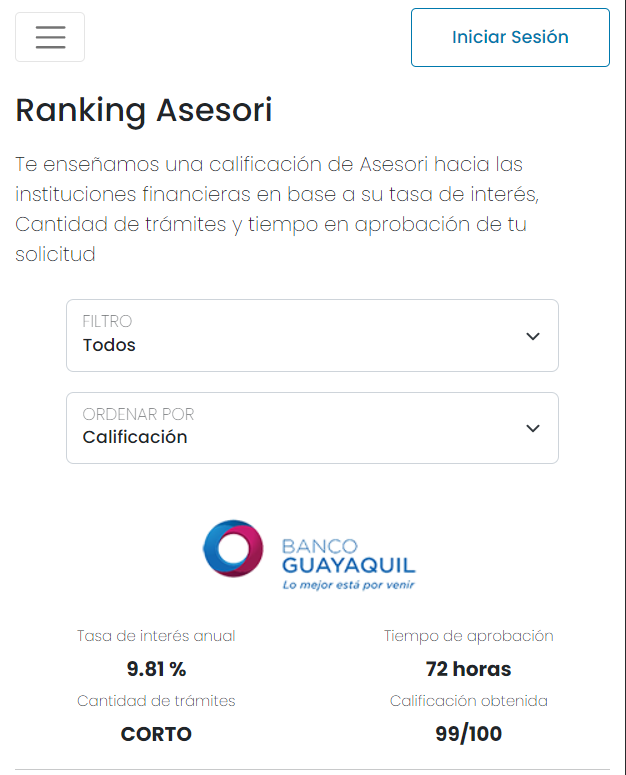</td>
  </tr>
  <tr>
    <td align="center" valign="center"></td>
    <td align="center" valign="center">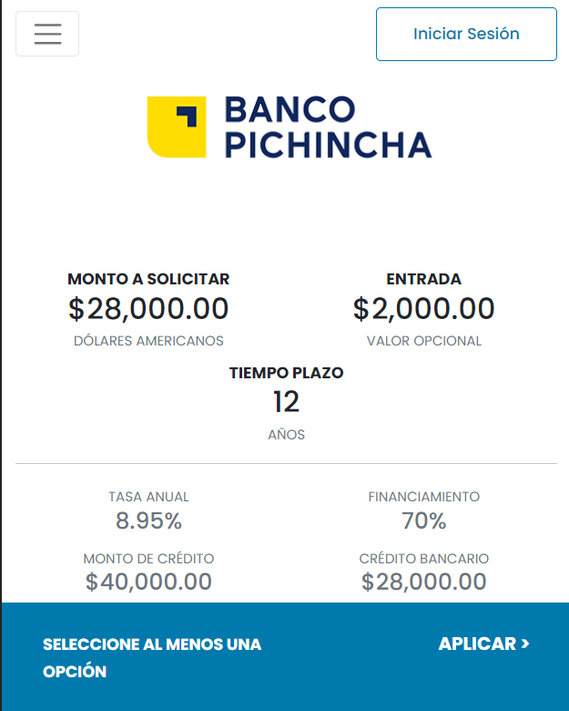</td>
  </tr>
</table>

## Stay in touch

- Website - [www.bryan-aguilar.com](https://www.bryan-aguilar.com/)
- Medium - [baguilar6174](https://baguilar6174.medium.com/)
- LinkeIn - [baguilar6174](https://www.linkedin.com/in/baguilar6174)
